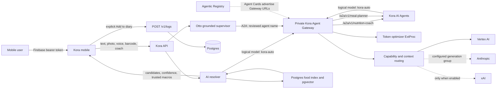
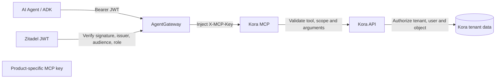
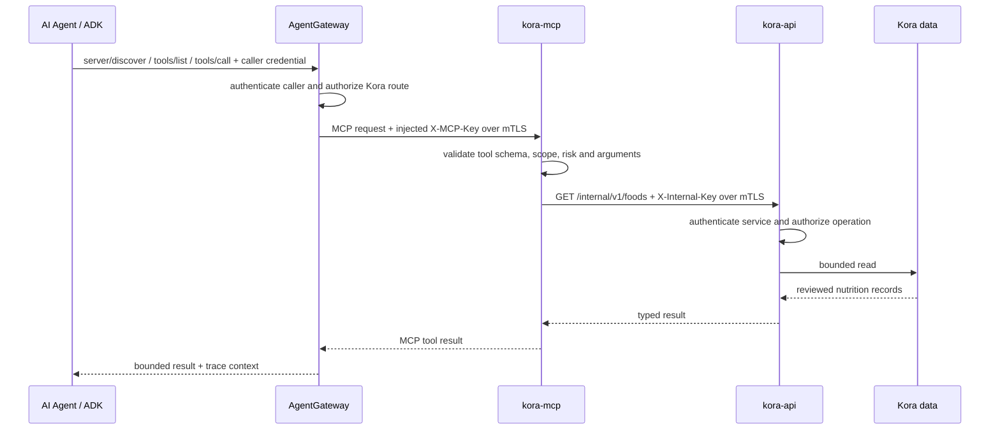
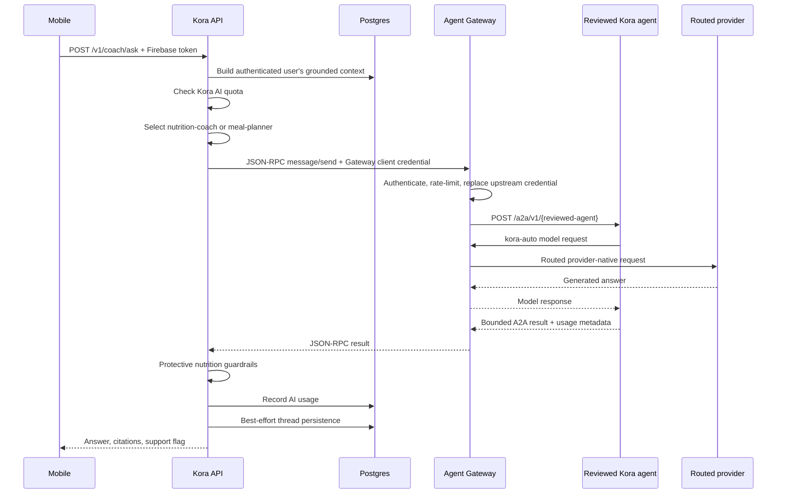
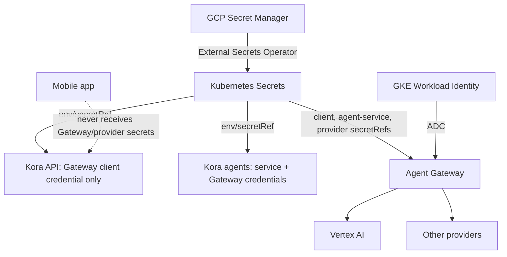
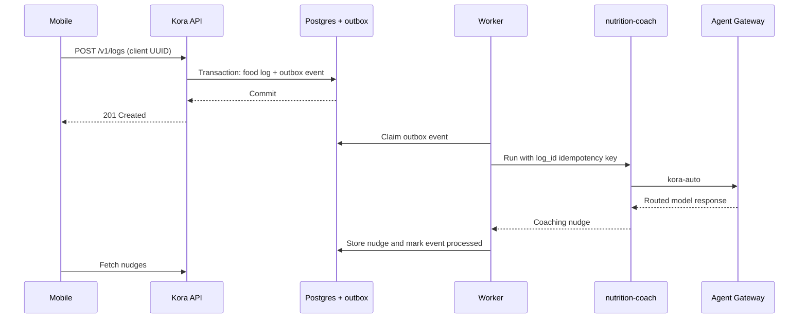

# Kora Agentic AI: End-to-End Architecture

Status: current-state design and integration contract
Last verified: 2026-09-04
Owners: Kora, AI Platform, and Platform Engineering

Future multi-product direction: [Multi-product AI platform
RFC](multi-product-ai-platform-rfc.md). This document remains the detailed
current-state contract for Kora. The approved delivery sequence is the [Kora AI
platform pilot plan](kora-ai-platform-pilot-execution-plan.md).

## Purpose

This document explains how a food photo, text description, voice clip, barcode,
or coach question moves from the Kora mobile application through Kora's private
AI infrastructure. It also explains where the independently deployed Kora AI
agents fit, what is implemented today, and which asynchronous product behavior
remains a proposed integration.

The central ownership rule is:

> Kora does not own or select concrete provider models. Kora sends the logical
> model `kora-auto`; the private Agent Gateway owns providers, concrete models,
> locations, credentials, translation, routing, optimization, and fallback.

Kora remains the authority for authenticated user identity, nutrition data,
confidence, user confirmation, quota entitlement, and food-log persistence.

## Scope and repository ownership

| Concern | Source repository | Runtime responsibility |
| --- | --- | --- |
| Mobile capture, confirmation, offline queue | `tesserix/kora` | Expo mobile application |
| Authenticated API, resolver, coach, nutrition truth, logging | `tesserix/kora` | `kora-api` |
| Reviewed agent definitions and agent HTTP/A2A runtime | `tesserix/ai-agents` | `kora-ai-agents` |
| Gateway routes, policies, providers, secrets wiring, workloads | `tesserix/tesserix-k8s` | GKE and Argo CD |
| Agent discovery metadata | `tesserix/ai-agents` | Agentic Registry |

The application and agent runtime have separate build and publication
pipelines. GitOps is the common deployment layer. Publishing an agent manifest
to the Agentic Registry does not deploy its runtime, and deploying
`kora-ai-agents` does not automatically connect Kora food capture to an agent.

## Current production topology

There are three orchestration paths today:

1. Food capture: mobile -> Kora API resolver -> Agent Gateway -> provider.
2. Otto coach Q&A: mobile -> Kora API supervisor -> Agent Gateway A2A route ->
   reviewed Kora agent -> the same Agent Gateway model route -> provider.
3. Direct model capabilities used by the resolver: Kora API -> Agent Gateway ->
   provider.

Food capture remains direct capability orchestration in Kora. Otto uses the
separate reviewed agent runtime, but cannot call it directly or discover an
arbitrary Agent Card URL at request time.

## Kora MCP authentication and authorization

Kora's AI does not hold the credential accepted by `kora-mcp`. The agent proves
its identity to AgentGateway, and AgentGateway adds the product-specific MCP
credential only after selecting the reviewed Kora route. The MCP then uses a
different internal credential when it reads Kora's product API.

The production path has four independent controls:

1. The public AgentGateway listener verifies a short-lived Zitadel JWT in
   strict mode, including its signature, issuer, audience, expiry, and
   `agentgateway.mcp` role. Trusted in-cluster ADK traffic uses the separately
   protected runtime listener.
2. AgentGateway reads Kora's backend credential from a Kubernetes Secret and
   injects it as `X-MCP-Key`. The agent and model never receive that value.
3. Istio Ambient mTLS authenticates every hop using Kubernetes ServiceAccount
   SPIFFE identities. The Kora waypoint authorizes the original
   `agentgateway-mcp` or `support-platform-slm-router` caller at the Service
   boundary; the MCP workload boundary admits only those direct callers or the
   Kora waypoint's forwarding identity.
4. For `search_nutrition`, `kora-mcp` sends a distinct `X-Internal-Key` to
   `GET /internal/v1/foods`. Kora API validates that service credential and
   remains the authority for product data. Future user-owned tools must also
   carry a short-lived, audience-bound user grant and re-authorize the user,
   tenant, object, and operation at Kora API.

These mechanisms answer different questions:

| Mechanism | What it proves | What it does not prove |
| --- | --- | --- |
| Zitadel JWT | Which user or machine called AgentGateway and which gateway role it holds | Permission to read a particular Kora object |
| SPIFFE mTLS certificate | Which Kubernetes workload opened the service connection | End-user identity or product entitlement |
| `X-MCP-Key` | AgentGateway selected and authenticated to the Kora MCP backend | User or tenant ownership |
| `X-Internal-Key` | The caller is the deployed Kora MCP service path | Permission for a future user-owned mutation |
| Kora API authorization | Whether this principal may perform this operation on this tenant-owned object | Nothing outside Kora's product boundary |

The MCP process is stateless. It must be reachable when a tool is discovered or
called, but the agent does not maintain a permanent connection. The current
2026-07-28 protocol carries its version, method, client capabilities, and tool
name in each request rather than creating a server session. Any invocation may
land on any replica; durable state and authorization remain in Kora API and its
datastores.

## Sizing and service targets

The existing quota ADR assumes a 10 requests/second peak and 10,000 monthly
active users. At one provider-backed request per active user per day, that is
approximately 3.65 million provider requests in 12 months and 10.95 million in
36 months. The quota-window projection is approximately 4.3 million rows in
12 months and 12.9 million in 36 months. These assumptions must be revalidated
before a material growth or launch event.

Current hard bounds are:

- photo body: 8 MiB file plus multipart overhead;
- voice body: 12 MiB file plus multipart overhead;
- coach question: 4,000 characters;
- standalone agent prompt: 12,000 characters;
- standalone agent execution: at most 20 seconds, two model calls, two
  iterations, 12,000 input tokens, and 2,000 output tokens;
- mobile request deadline: 25 seconds;
- Gateway model-route request timeout: 120 seconds;
- Gateway A2A request deadline: 23 seconds;
- Kora Otto A2A request deadline: 24 seconds, inside mobile's 25-second
  request deadline.

The availability target inherited from the quota ADR is 99.9% monthly for the
AI path. End-to-end latency SLOs have not yet been ratified or measured. The
recommended targets are p99 <= 10 seconds for text/photo resolution, p99 <= 15
seconds for voice resolution, and p99 <= 1 second for the food-log write after
confirmation. Those targets are proposals, not current measured guarantees.

## Food capture flow

### 1. Capture and authenticate

The mobile capture screen accepts text, a camera/library photo, a voice clip,
or a barcode. The mobile application calls only Kora's public API and never
calls Agent Gateway or a provider directly.

Every `/v1` route is protected by Firebase authentication. Kora derives the
user identity from the verified token; the client does not supply a trusted
`user_id`, tenant, role, model, provider, or Gateway routing header.

The relevant endpoints are:

| Input | Endpoint | Request shape |
| --- | --- | --- |
| Text | `POST /v1/resolve/text` | JSON `{ "phrase": "..." }` |
| Photo | `POST /v1/resolve/photo` | Multipart field `file` |
| Voice | `POST /v1/resolve/voice` | Multipart field `file` |
| Barcode | `POST /v1/resolve/barcode` | JSON `{ "barcode": "..." }` |

Implementation references:

- [mobile capture](../../apps/mobile/app/capture.tsx)
- [mobile API hooks](../../apps/mobile/src/api/hooks.ts)
- [authenticated routes](../../api/internal/server/router.go)
- [resolve HTTP boundary](../../api/internal/resolve/handler.go)

### 2. Resolve without AI when possible

For text, Kora first checks the authenticated user's personal correction alias.
A hit returns the trusted food row immediately. The normal resolver then checks
its user-scoped cache before reserving quota or making a provider call.

Barcode resolution is a separate deterministic path. It resolves from Kora's
food data or OpenFoodFacts and never calls Agent Gateway. A repeated barcode
can also resolve from the mobile offline cache.

### 3. Enforce Kora quota

On a cache miss, Kora checks the provider-backed AI budget. Kora's database is
the entitlement and billing authority. Agent Gateway may enforce a stricter
rate or token policy, but it cannot grant Kora quota or infer a user's plan.

When quota is exhausted, the resolver returns a `follow_up` response without
calling a model. Cache and personal-alias hits remain provider-free.

See [ADR-0001: AI quota authority](../adr/0001-ai-quota-authority.md).

### 4. Classify the request for the Gateway

When `AI_GATEWAY_ENABLED=true`, Kora creates one logical provider with the
model `kora-auto`. Kora attaches server-owned classification headers:

| Kora capability | `X-Kora-AI-Capability` | `X-Kora-AI-Context-Kind` |
| --- | --- | --- |
| Text identification | `identify_text` | `json_api` |
| Photo identification | `identify_photo` | `json_api` |
| Dish decomposition | `decompose` | `json_api` |
| Embedding | `embedding` | `embedding` |
| Voice transcription | `transcribe` | `audio` |
| Coach generation | `coach` | `conversation` |

Kora also sends `X-Kora-RTK-Applied: false`, allowing the Gateway's optimizer
to make the optimization decision. Inbound mobile headers are never copied to
these server-owned fields.

Implementation reference: [Agent Gateway provider](../../api/internal/ai/providers/agentgateway.go).

### 5. Authenticate, protect, and optimize at Agent Gateway

The Gateway is cluster-private. Kora receives only a Gateway client credential,
injected from GCP Secret Manager through External Secrets Operator. The mobile
application never receives this credential.

The Gateway applies:

- strict API-key authentication;
- mesh workload authorization for the Kora API and Kora agent service;
- NetworkPolicy restrictions;
- local request and token rate limits;
- prompt guards for sensitive identifiers and instruction injection;
- response masking for sensitive identifiers;
- capability/context metrics;
- token-optimizer ExtProc processing.

The token optimizer receives only classification attributes, not a client-
asserted identity. It can choose the appropriate optimization strategy for
structured JSON, embedding, audio, or conversational requests. Its policy is
currently fail-open: if the optimizer is unavailable, the Gateway continues
without optimizer processing instead of taking down food capture.

### 6. Select a provider and concrete model

The Gateway routes by capability and context:

- embeddings -> the embedding backend;
- conversations -> the conversation backend;
- structured JSON and the default route -> the structured backend.

The current desired state configures:

- Vertex `gemini-3.5-flash` for generation;
- Vertex `gemini-embedding-001` for embeddings;
- Anthropic `claude-sonnet-4-5` as an additional generation provider group;
- xAI `grok-4` only when explicitly enabled; it is disabled today.

Kora does not send these names. Agent Gateway translates Kora's OpenAI-
compatible request to the provider-native protocol, including Vertex's native
generation endpoint.

Vertex authentication currently uses the Gateway pod's GKE Workload Identity
and Google application-default credentials. Kora does not possess a Vertex key.
The GitOps chart also syncs a named Vertex API-key secret, but the current
Vertex backend uses `auth.gcp` and does not reference that secret. Anthropic and
the optional xAI backend use Gateway-owned provider secrets.

### 7. Identify food, then retrieve nutrition truth

The model returns food identity, brand, qualifiers, cooking method, portion
estimate, and confidence. The model response type structurally contains no
calories or macros.

For each guess, Kora may request an embedding through the same Gateway and then
searches the Postgres/pgvector nutrition index. If embedding fails, it is an
optional ranking signal and the resolver continues with non-vector matching.

Calories and macros are computed only from the selected `food_items` row and
the resolved grams. This invariant prevents a model from inventing nutrition
facts.

Implementation references:

- [AI response types](../../api/internal/ai/types.go)
- [resolver pipeline](../../api/internal/ai/resolver.go)
- [nutrition repository](../../api/internal/nutrition/repository.go)

### 8. Return confidence and require the appropriate user action

Kora combines model confidence, nutrition-index match quality, phrase coverage,
and deterministic ranking rules into one of three tiers:

- `auto`: confidence >= 0.90;
- `confirm`: confidence from 0.70 to 0.90;
- `follow_up`: confidence < 0.70 or no reliable match.

Weak matches may be shown for correction instead of being silently replaced by
a model-generated decomposition. Decomposition is reserved for a composite dish
with no usable food-index row, and inferred ingredients cannot become `auto`.

The mobile UI displays candidates and lets the user confirm, exclude, change,
or manually search. Resolution alone does not create a food log.

### 9. Persist only after user confirmation

When the user selects **Add to diary**, mobile sends one `POST /v1/logs` per
selected candidate. It sends the food row ID, portion, source, meal slot, and
capture time—not trusted calories or macros.

The server:

1. derives the authenticated user;
2. reloads the food item by ID;
3. resolves any entered serving unit to grams;
4. recomputes calories and macros from the food row;
5. stores the log in Postgres.

Mobile creates the log UUID before sending. `CreateIdempotent` uses that UUID to
make a lost response and offline replay return the original row rather than
duplicate the meal. Multiple selected candidates are currently independent
writes; mobile uses `Promise.allSettled` and reports partial success.

Text and voice logs may retain the input phrase so a later user correction can
teach a personal alias. Photo and barcode logs do not retain a phrase.

Implementation references:

- [food-log service](../../api/internal/foodlog/service.go)
- [idempotent repository](../../api/internal/foodlog/repository.go)

## Otto supervisor path

Otto keeps authentication, user-scoped grounding, quota, citations, and final
protective checks inside Kora while delegating generation to a reviewed A2A
agent through Agent Gateway:

The Firebase token terminates at Kora API. Neither it nor a user or tenant
header is forwarded. The supervisor selector accepts only `nutrition-coach`
and `meal-planner`; arbitrary agent names and URLs are rejected before network
I/O. The agent sees rendered, server-derived context and is instructed not to
invent numbers. Kora applies an additional protective policy after generation.
An A2A failure never falls back to a direct provider call, while a thread-
storage failure does not discard an answer already generated for the user.

Implementation references:

- [coach service](../../api/internal/coach/service.go)
- [coach grounding](../../api/internal/coach/grounding.go)
- [coach HTTP boundary](../../api/internal/coach/handler.go)
- [A2A Gateway client](../../api/internal/agents/gateway.go)
- [reviewed agent selector](../../api/internal/agents/selector.go)
- [ADR-0002: Otto through AgentGateway A2A](../adr/0002-otto-agentgateway-a2a.md)

## Standalone Kora AI agents

`kora-ai-agents` is a separate internal service deployed with two replicas. It
currently publishes two reviewed agents:

| Agent | Contract |
| --- | --- |
| `nutrition-coach` | Bounded free-text general nutrition guidance |
| `meal-planner` | Validated structured meal plans of at most seven days |

The runtime exposes authenticated discovery and execution endpoints:

- `GET /v1/agents`;
- `POST /v1/agents/{agent_name}/runs`;
- `POST /a2a/v1/{agent_name}` using JSON-RPC `message/send`.

The runtime fixes tenant identity to `kora`; callers cannot select a tenant.
Agent definitions apply PII, prompt-injection, and medical-safety guardrails,
have no tools by default, and enforce model-call, token, iteration, prompt-size,
and wall-clock budgets.

The Agentic Registry contains discovery metadata whose Agent Cards advertise
the private Agent Gateway A2A addresses. It is a control/discovery plane, not
the model data plane. Otto uses its reviewed local selector rather than trusting
registry metadata as runtime routing input. A model run returns from
`kora-ai-agents` through the private Kora Agent Gateway.

The agent service has a service API credential for its Gateway-authenticated
caller and a separate Gateway client credential for outbound inference. The
Gateway, not Kora API, injects the service credential on A2A requests. The
agent runtime holds no Vertex, Anthropic, or xAI credentials and still requests
only `kora-auto`.

## Trust boundaries and secret flow

Trust-boundary rules:

- Mobile authenticates to Kora with Firebase; it never holds a Gateway or
  provider credential.
- Kora derives identity and routing headers server-side.
- The Gateway authenticates Kora's client credential and allowed workload
  identity, then replaces it with the agent-service credential for A2A;
  NetworkPolicy limits the network path through the Kora waypoint.
- Concrete provider credentials exist only in the Gateway trust domain.
- Secrets are never committed, logged, returned by APIs, placed in URLs, or
  exposed in observability payloads.
- Provider prompts and user uploads are bounded at the Kora or agent boundary.
- Nutrition facts are re-derived from trusted server-side data before write.

## Failure and degradation behavior

| Failure | Current behavior |
| --- | --- |
| Mobile network unavailable | Recoverable text/photo/voice capture and food-log writes are queued; a known barcode can resolve from the local cache. |
| Personal alias or resolution cache hit | Return without a provider call. |
| Kora quota exhausted | Return a follow-up/degraded answer without calling the Gateway. |
| Token optimizer unavailable | Gateway fails open and continues without optimization. |
| Embedding call fails | Continue with deterministic/non-vector food matching. |
| Gateway or provider unavailable | Resolution/coach request fails safely; no food log is created automatically and manual food search remains available. |
| Agent runtime unavailable | Otto fails safely without a direct-model bypass; food capture remains independent. |
| Coach thread persistence fails | Return the generated, guardrail-checked answer and log the storage failure. |
| Postgres unavailable during log write | No durable food log is acknowledged; network/timeout ambiguity is safe to replay because the client UUID is idempotent. |
| Duplicate food-log delivery | Return the row stored under the same client-generated UUID. |
| Invalid or cross-user log ID | Reject without disclosing another user's object. |

No retry should be independently enabled at the mobile client, mesh, Gateway,
and provider at the same time. The current timeout layers need an explicit
retry ownership review before automatic model retries are expanded.

## Observability and privacy

Kora records provider, model returned by the Gateway, capability/call type,
token counts, latency, cost estimate, and outcome in `ai_usage_events`. Failed
provider attempts are recorded as well as successful ones. The Gateway exports
capability and context-kind metrics. The agent runtime emits request ID, route,
status, duration, and error type without logging prompts or secrets.

Logs should contain identifiers and aggregate diagnostics, not raw images,
audio, access tokens, credentials, full request bodies, or user-entered phrases.
Any diagnostic that needs content must be explicitly privacy-reviewed and
retention-bounded.

## Proposed asynchronous post-log agent integration — not implemented

The safest way to use `nutrition-coach` after a confirmed meal is asynchronous:

Required properties:

- insert the food log and outbox event in one Postgres transaction;
- never call an agent while holding the database transaction open;
- use `log_id` as the event and consumer idempotency key;
- deliver at least once and deduplicate in the consumer;
- retry only timeouts, connection failures, `429`, and `5xx` with exponential
  backoff and jitter;
- dead-letter and alert after a bounded attempt count;
- store a queryable terminal state for success or failure;
- never block or roll back food logging because an agent or model is down;
- send only the minimum server-derived, authenticated context required;
- keep mobile isolated from the agent service and Gateway credentials.

This is an outbox plus idempotent consumer problem, not yet a multi-step saga;
Temporal is not required unless later workflows add human waits, compensations,
or more than two durable remote steps.

## Known gaps and decisions still required

1. Decide whether to add proactive post-log nudges; explicit coach and meal-plan
   requests are already handled by Otto through A2A.
2. If proactive nudges are approved, add the transactional outbox, worker, idempotent agent-run contract, nudge
   persistence, and mobile retrieval UI for asynchronous post-log coaching.
3. Ratify and instrument end-to-end latency SLOs; the current values are hard
   deadlines, not measured objectives.
4. Align the mobile, Kora API, agent runtime, and Gateway timeout/retry policy so
   one user action cannot multiply into retry amplification.
5. Confirm whether the unused synced Vertex API-key entry should be removed;
   Vertex currently uses Workload Identity and `auth.gcp`.
6. Add retention decisions for coach turns, AI usage events, queued captures,
   and any future agent-generated nudges.

## Source map

Kora implementation:

- `apps/mobile/app/capture.tsx`
- `apps/mobile/src/api/hooks.ts`
- `api/internal/server/router.go`
- `api/internal/resolve/handler.go`
- `api/internal/ai/resolver.go`
- `api/internal/ai/providers/agentgateway.go`
- `api/internal/coach/service.go`
- `api/internal/agents/gateway.go`
- `api/internal/agents/selector.go`
- `api/internal/foodlog/service.go`
- `api/internal/foodlog/repository.go`
- `docs/adr/0001-ai-quota-authority.md`
- `docs/adr/0002-otto-agentgateway-a2a.md`

External implementation sources:

- `tesserix/ai-agents/src/kora_agents/definitions.py`
- `tesserix/ai-agents/src/kora_agents/runtime.py`
- `tesserix/ai-agents/src/kora_agents/api.py`
- `tesserix/ai-agents/src/kora_agents/gateway.py`
- `tesserix/ai-agents/registry/`
- `tesserix/tesserix-k8s/charts/apps/kora-api/`
- `tesserix/tesserix-k8s/charts/apps/kora-ai-agents/`
- `tesserix/tesserix-k8s/charts/apps/kora-ai-gateway/`
