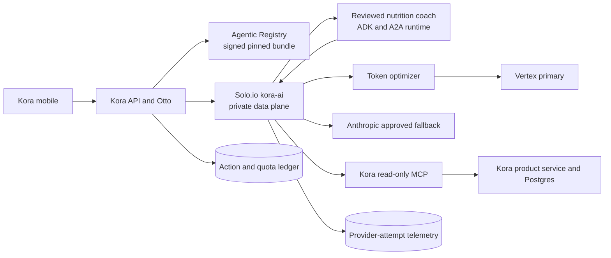

# Kora governed AI platform pilot execution plan

<!-- markdownlint-disable MD013 -->

- Status: approved product selection; implementation gated per issue
- Product decision: Kora
- Initial capability: read-only nutrition coach
- Owner and GitHub assignee: `sam123ben`
- GitHub tracker: [Kora governed AI platform pilot #380](https://github.com/tesserix/kora/issues/380)
- Date: 2026-08-23
- Architecture: [multi-product AI platform RFC](multi-product-ai-platform-rfc.md)
- Shared delivery plan: [multi-product implementation plan](multi-product-ai-platform-implementation-plan.md)
- Current Kora contract: [Kora agentic AI end-to-end](agentic-ai-end-to-end.md)

## Outcome

Deliver one production-proven Kora nutrition-coach request that is authenticated,
tenant-scoped, Registry-resolved, digest-pinned, budgeted, evaluated, and routed
through the isolated Solo.io `kora-ai` data plane to a reviewed A2A agent, an
authorized read-only product MCP resource, and an approved provider/model alias.

The pilot is complete only when the deployed path has recent positive and
negative conformance evidence, reconciled action/provider-attempt usage, a
measured SLO, and a one-action rollback. Healthy pods, accepted Gateway objects,
merged code, or Registry publication alone do not complete the pilot.

## Delivery discipline

Only one implementation issue may be in progress at a time. For each issue:

1. Confirm its dependencies and exact repository owners.
2. Branch from the current default branch using the GitHub issue number.
3. Write and run the regression or behavior test first; record the intended
   failure.
4. Implement the smallest scoped change and run the affected full suite.
5. Run security, dependency, build, lint, and race checks required by the
   affected repository.
6. Open a PR that references the issue without auto-closing it on merge.
7. Require green CI and review before merge.
8. Publish and promote through the owning GitOps path; do not patch live
   resources that Argo CD owns.
9. Before a production mutation, state the active account, project, cluster,
   namespace, exact image/policy target, rollout, and rollback, then obtain the
   specific rollout approval required by the repository safety rules.
10. Verify the deployed positive path, required negative paths, metrics, logs,
    policy/artifact digests, and rollback readiness.
11. Close the issue only after deployment evidence is attached. Then update the
    tracking epic and start the next unblocked issue.

This sequencing prevents a merged PR from being mistaken for a deployed and
operationally proven capability.

## Scope

Included:

- Kora API/Otto as the only product-facing AI interface;
- secure internal delegation from verified Firebase principal;
- fail-closed Agentic Registry bundle resolution;
- reviewed ADK/A2A nutrition-coach runtime;
- private Solo.io `kora-ai` model, embedding, and A2A routes;
- one read-only Kora MCP resource/tool with product re-authorization;
- logical provider alias, fallback, budgets, and token optimization;
- action and provider-attempt usage reconciliation;
- safety, injection, quality, cost, and reliability evaluation gates;
- scheduled conformance, observability, HA, canary, and rollback evidence.

Excluded from the first pilot:

- mutating or destructive MCP tools;
- automatic changes to nutrition targets or food logs;
- arbitrary/dynamic agents, kagent, ATE, or untrusted generated code;
- model fine-tuning from production conversations;
- a new workflow engine, registry, SDK, datastore, or product microservice;
- making Temporal a dependency of the synchronous read-only coach request.

Temporal remains the required orchestrator when a later Kora capability has more
than two distributed steps, a human approval, or a wall-clock wait. Training and
untrusted execution remain offline, consented, isolated, and separately accepted.

## Current baseline

Verified on 2026-08-23:

- Solo.io Agent Gateway v1.4.1 controller and `GatewayClass/agentgateway` are
  operational.
- `kora-ai` is programmed at 2/2 and has live Vertex chat, embedding, and two
  reviewed A2A agent successes.
- Kora API verifies Firebase but currently forwards the raw login token through
  Solo.io to the A2A runtime, which sends it back on model calls.
- Agentic Registry and Kora API are each 1/1.
- Anthropic fallback is configured but lacks a controlled live proof.
- PR #370 implements fail-closed Registry-backed execution, but its CI jobs fail
  before executing their steps and it is not deployed.
- Kora has no accepted product MCP read/tool surface for this pilot.
- Some provider/fallback paths under-record tokens and cost (#376 and #152).

## Capacity and SLO assumptions

| Measure | Planning value | Evidence/gate |
| --- | --- | --- |
| Peak AI traffic | 10 requests/second | Existing Kora gateway and ADR assumption; validate from production histograms |
| Current observed reviewed volume | 7,480 requests over one reviewed 24-hour window | Point-in-time evidence, not a long-term forecast |
| Maximum public request body | 256 KiB | Existing API/gateway planning bound; enforce before expensive parsing |
| A2A deadlines | 20-second agent, 23-second Gateway, 24-second Kora, 25-second mobile | ADR 0002; one owner per retry boundary |
| A2A run budget | At most 2 model calls, 12,000 input tokens, and 2,000 output tokens | ADR 0002; count failed and fallback attempts |
| AI availability | 99.9% monthly | Initial objective; ratify exclusions and measurement source |
| Gateway overhead | p99 no more than 50 ms excluding optimizer/provider | Scheduled conformance measurement |
| Text/photo user path | Proposed p99 no more than 10 seconds | Ratify from real histograms before GA |
| Voice user path | Proposed p99 no more than 15 seconds | Outside first read-only coach slice but retained as product objective |
| Quota decision | p99 below 20 ms | ADR 0001 |

At the current observed daily volume, one action row per request is about 2.73
million rows in 12 months and 8.19 million in 36 months. With up to three
provider/agent attempts per action, the attempt ledger upper planning range is
about 8.19 million and 24.57 million rows. ADR 0001 separately bounds quota
window rows at about 4.3 million and 12.9 million for 10,000 monthly active
users. These are Postgres-scale tables, not a reason to shard. Retention,
indexes, real read/write mix, and database growth must be measured before the HA
and GA gates.

## Security model

Assets worth protecting are Kora health-adjacent/user-private data, provider
credentials, product/tool authority, prompts and outputs, Registry artifacts,
usage/budget state, traces, and future evaluation/training data. Relevant
attackers are unauthenticated internet callers, one authenticated user attacking
another user, unrelated or compromised workloads, malicious prompt/retrieval
content, poisoned Registry metadata, compromised MCP/tool servers, and insiders
with overly broad credentials.

The target trust chain is:

```text
Firebase login token
  -> Kora API verifies and resolves the Kora principal
  -> login token terminates
  -> Kora workload identity plus short-lived Kora AI delegation
  -> Solo.io validates workload, issuer, audience, expiry, capability, and run
  -> reviewed agent receives only narrowed context and scopes
  -> MCP/product boundary re-authorizes user, object, and operation
  -> provider receives no end-user or product credential
```

Every boundary defaults to deny. Authority is the intersection of the verified
user, Kora policy, selected agent declaration, capability budget, and exact MCP
tool grant. Returned model, Registry, peer, retrieval, and MCP content remains
untrusted data and can never widen authority or choose a destination.

## Fixed architecture and failure behavior



| Dependency failure | Required behavior |
| --- | --- |
| Registry unavailable | Use only a verified, unexpired stale bundle allowed by policy; otherwise fail closed |
| Bundle/ref unresolved or digest invalid | Reject before network I/O; no local agent or direct-model substitute |
| Solo/A2A unavailable | Typed unavailable response; no provider bypass |
| Optimizer unavailable | Send the original eligible request within its existing deadline and record bypass |
| Vertex definite transient failure | One Gateway-owned equivalent fallback when schema, residency, deadline, and total budget allow it |
| MCP read failure | Bounded retry only for a safe transient error; otherwise typed partial/unavailable response |
| Usage/quota authority unavailable | Provider-backed product request fails closed |
| Telemetry exporter unavailable | Do not lose durable action/attempt evidence; high-cardinality payloads remain excluded |
| Kora API or Registry pod loss | Remaining replicas serve within the accepted disruption objective after HA work |

## Dependency-ordered work packages

| Work ID | GitHub work package | Depends on | Completion result |
| --- | --- | --- | --- |
| KAI-01 | [#381 Deploy fail-closed Registry-backed A2A execution](https://github.com/tesserix/kora/issues/381) | PR #370; relates #338 | Unresolved/failed Registry or A2A paths cannot bypass to direct model; deployed proof attached |
| KAI-02 | [#382 Exchange Firebase login token for internal Kora AI delegation](https://github.com/tesserix/kora/issues/382) | KAI-01; relates #252 and ADR 0002 | Raw login token terminates at Kora API; Solo and agent validate narrowed grant |
| KAI-03 | [#383 Version capability envelope and digest-pinned resolved bundle](https://github.com/tesserix/kora/issues/383) | KAI-01, KAI-02; relates #338 | Server-derived capability, artifact closure, policy version, budgets, and decision record are consistent |
| KAI-04 | [#384 Add one read-only Kora nutrition MCP resource/tool](https://github.com/tesserix/kora/issues/384) | KAI-02, KAI-03 | Agent retrieves current user-scoped nutrition facts without prompt stuffing or mutation |
| KAI-05 | [#385 Enforce MCP destination and per-product/user/tool authorization](https://github.com/tesserix/kora/issues/385) | KAI-04 | Registry discovery cannot grant reachability; cross-user, redirect, SSRF, and grant-widening tests fail closed |
| KAI-06 | [#386 Prove provider, fallback, and optimizer conformance](https://github.com/tesserix/kora/issues/386) | KAI-03; relates #251 and #248 | Vertex primary, Anthropic fallback, schemas, guardrails, token savings, deadlines, and rollback meet gates |
| KAI-07 | [#387 Reconcile product action and provider-attempt ledgers](https://github.com/tesserix/kora/issues/387) | KAI-03; includes #376 and #152 | Failed, zero-token, abandoned, optimized, and fallback legs are attributable and budgeted |
| KAI-08 | [#388 Make nutrition-coach evaluation evidence a routing gate](https://github.com/tesserix/kora/issues/388) | KAI-03 through KAI-07 | Pinned baseline beats required safety, injection, quality, schema, grounding, latency, and cost thresholds |
| KAI-09 | [#389 Add scheduled readiness canary, dashboards, retention, and runbook](https://github.com/tesserix/kora/issues/389) | KAI-03 through KAI-08; relates #43 | Each enabled path has fresh authenticated proof, typed readiness, SLO ownership, and no payload/PII telemetry |
| KAI-10 | [#390 Prove Kora API and Registry HA and one-pod-loss behavior](https://github.com/tesserix/kora/issues/390) | KAI-09 | Capacity-checked replicas, disruption policy, topology spread, connection limits, and recovery evidence exist |
| KAI-11 | [#391 Canary and approve the read-only Kora pilot](https://github.com/tesserix/kora/issues/391) | KAI-01 through KAI-10 | Internal/shadow/canary evidence passes; rollback rehearsed; owner records GA or no-go decision |

Only KAI-01 is initially unblocked. KAI-02 starts after KAI-01 is merged,
deployed, and verified. Work that can later run in parallel is still executed one
issue at a time for this pilot, per the approved tracking discipline.

## Acceptance criteria required on every issue

Every implementation issue must state and satisfy:

- exact in-scope behavior and explicit non-goals;
- principal, product, tenant, resource, operation, and destination authorization;
- bounded request/response schemas and no trusted client routing/identity fields;
- timeout, cancellation, retry owner, idempotency, and uncertain-outcome behavior;
- logs/metrics/traces that exclude bearer tokens, credentials, raw prompts,
  outputs, and user PII;
- failing regression/behavior test before implementation;
- positive, error-path, cross-user/cross-tenant, forged-input, and dependency
  failure tests appropriate to the boundary;
- safe migration, feature gate/canary where needed, and one-action rollback;
- cost/capacity effect and SLO measurement;
- updated architecture/runbook/contracts when behavior changes.

## Definition of Done required on every issue

An issue is done only when:

- its dependencies and owner-approved scope are recorded;
- code and tests are reviewed and merged without unrelated changes;
- required formatting, lint, typecheck, build, race, vulnerability, secret, and
  configuration scans pass or an existing unrelated finding is documented;
- CI is green and immutable artifacts are published with provenance;
- desired state is promoted through GitOps, not patched imperatively;
- the exact deployed artifact/policy digest and environment are recorded;
- positive and required negative production-safe conformance checks pass;
- SLO, error, usage, cost, and fallback telemetry show no gate breach;
- rollback remains available and has been rehearsed at the required stage;
- the issue contains PR, test, deployment, verification, dashboard/runbook, and
  follow-up evidence;
- the tracking epic is updated and the issue is manually closed only after
  deployment verification.

## First issue execution decision

KAI-01 is selected first because its implementation already exists on
`fix/ai-gateway-registry-fail-closed` in PR #370, it is a prerequisite for all
later trust-chain work, and it currently fails at the CI boundary before any job
steps run. The immediate sequence is:

1. start assigned issue #381 and mark it as the only active pilot work;
2. link PR #370 without auto-closing #381;
3. diagnose and repair the CI execution failure without weakening checks;
4. re-run the documented Go and security suites;
5. merge only after green review/CI;
6. identify the immutable Kora API artifact and GitOps promotion;
7. obtain the exact production rollout approval required by repository rules;
8. verify fail-closed Registry/A2A behavior and both reviewed agents;
9. attach evidence, close KAI-01, update the epic, and start KAI-02.

## Pilot completion decision

Kora is pilot-ready only when KAI-01 through KAI-11 are closed with deployment
evidence. The final decision record must name the capability and artifact/policy
digests, evidence window, residual risks, SLO/cost results, owners, rollback,
retention decisions, and whether the capability is approved for broader traffic.
