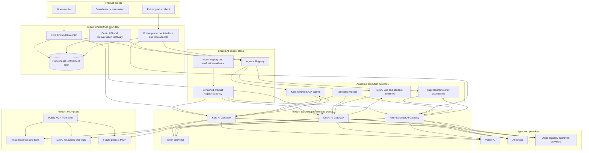
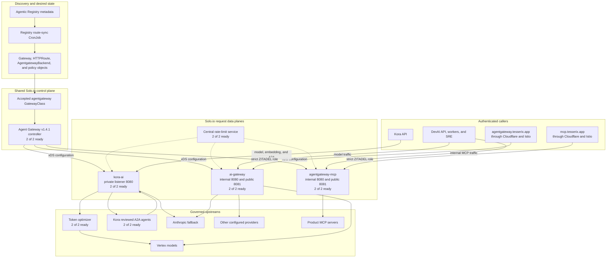
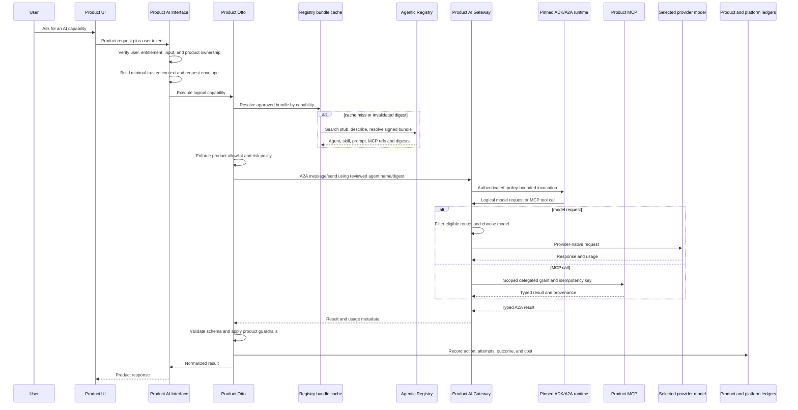
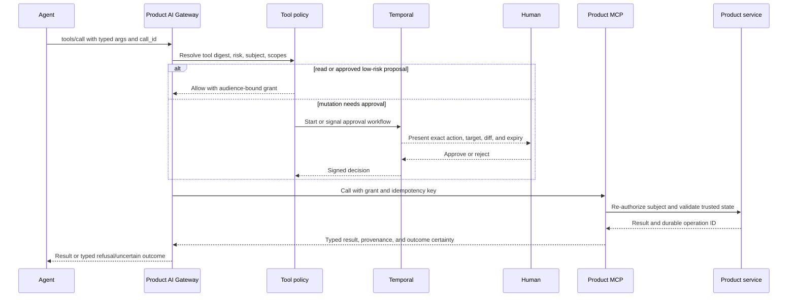
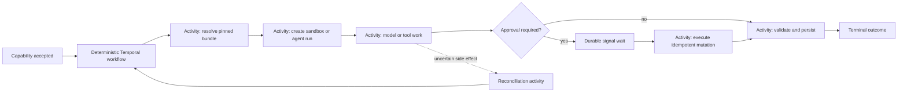

# RFC: Multi-product AI gateway, agent, MCP, and model platform

<!-- markdownlint-disable MD013 -->

- Status: proposed
- Date: 2026-08-23
- Owners: AI Platform, Product Engineering, Platform Engineering, Security
- Initial products: Kora and DevAI
- Current Kora design: [Kora agentic AI end-to-end](agentic-ai-end-to-end.md)
- Related delivery plan: [multi-product AI platform implementation plan](multi-product-ai-platform-implementation-plan.md)

## Executive decision

Tesserix should expose AI through a product-owned **AI Interface API**, not let
mobile clients, web clients, Otto, or arbitrary agents call a provider, an MCP
server, or an Agent Card URL directly.

Each product gets an isolated gateway policy and data plane. The product API
authenticates the user, builds trusted product context, checks entitlement, and
submits a logical capability request. Otto is the conversational orchestrator
behind that product API. Otto resolves only reviewed, digest-pinned agents and
skills from Agentic Registry, executes them through an accepted ADK-compatible
runtime, and routes all model, A2A, and MCP traffic through the product gateway.

The platform has five distinct responsibilities:

1. **Product AI Interface API** owns user identity, product truth, entitlement,
   confirmation, and the final response contract.
2. **Agentic Registry** is the versioned discovery and configuration control
   plane. It is not a proxy, credential issuer, or deployment controller.
3. **ADK and A2A runtimes** execute reviewed agent bundles. ADK defines the
   portable runtime, security, budget, durability, and tool contracts.
4. **Product AI Gateway** authenticates workloads, enforces policy, chooses an
   eligible provider/model, routes A2A and MCP calls, and records attempts.
5. **Product MCP servers** expose current product knowledge and narrowly scoped
   actions. MCP is how agents learn current product behavior; model fine-tuning
   is a separate, offline, governed lifecycle.

In the current platform, **Product AI Gateway means a Solo.io Agent Gateway
data plane**. Kora already has the isolated `kora-ai` plane; `ai-gateway` is the
shared model plane used by DevAI and the authorized public front door; and
`agentgateway-mcp` is the internal/public MCP plane. One shared Solo.io
controller programs all three, while product policy and identity keep their
traffic and authority separate.

This design deliberately does not introduce another SDK, registry, workflow
engine, or agent orchestrator. It joins the systems already present in the ADK,
Agentic Registry, AI Agents, DevAI, token optimizer, and GitOps repositories.

## Readiness statement as of 2026-08-23

The platform is partially operational, but it is not yet correct to say that
every AI agent, MCP server, and provider will always work. A read-only
production reconciliation on 2026-08-23 confirmed the expected GCP project,
GKE context, and the concrete Solo.io resources below.

| Area | Evidence | Readiness |
| --- | --- | --- |
| Solo.io control plane | Agent Gateway v1.4.1 controller is 2/2; `GatewayClass/agentgateway` is accepted | Operational control plane |
| Solo.io data planes | `kora-ai`, `ai-gateway`, and `agentgateway-mcp` are each programmed and 2/2 | Operational data-plane fabric; readiness still varies by route/upstream |
| Solo.io configuration | 26 `AgentgatewayBackend` objects are accepted; 11 MCP `HTTPRoute` objects are accepted and resolved; all observed policies are attached | Configuration accepted, not by itself end-to-end proof |
| Kora private AI Gateway | 7,400 successful requests in 7,480 reviewed over 24 hours; Vertex chat and embeddings work | Operational for the proven Kora routes |
| Kora A2A | 15 successful reviewed runs: 8 meal planner and 7 nutrition coach; agent service is 2/2 | Operational for the two pre-deployed agents |
| Kora provider fallback | Vertex generation and embeddings are live; Anthropic is configured as generation fallback | Configured, not live-proven |
| DevAI gateway wiring | API, workers, and SRE point at internal Solo.io model and MCP data planes | Wired; each provider/MCP path still needs its own conformance evidence |
| Public MCP gateway at `mcp.tesserix.app` | 11 server-specific routes are accepted/resolved and the public listener enforces a ZITADEL role | Not machine-auth ready: OAuth protected-resource metadata redirects to browser login and `401` lacks a useful challenge; authenticated upstream conformance remains unproven |
| Public model gateway at `agentgateway.tesserix.app` | Public Solo.io listener has strict ZITADEL role policy; provider routes exist | Most non-Vertex backends use credential passthrough; this is not yet a gateway-owned provider credential plane |
| Generic dynamic agents | kagent controller is `CrashLoopBackOff`; ATE API is not ready | Unavailable and not an accepted sandbox runtime |
| DevAI sandboxes and evaluations | Substantial application contracts, APIs, storage, traces, evaluation, and promotion gates exist | Application capability exists; production runtime isolation and kagent/Substrate acceptance remain gated |
| Temporal | HA services are deployed, but `temporal-platform` is progressing with one frontend pending; DevAI durability acceptance is incomplete | Not yet the proven production AI durability backbone |
| Model improvement | Evaluation and agent-promotion primitives exist; one support export produces raw per-tenant JSONL prerequisites | No governed end-to-end training or fine-tuning pipeline |
| High availability | Kora API and Agentic Registry are each 1/1; Gateway data planes and Kora agent runtime are 2/2 | Product API and Registry remain below the desired resilience |

These are point-in-time findings, not an SLO report. “Accepted by a controller,”
“published in Registry,” and “configured in Helm” are not production success
criteria. Readiness requires an authenticated request, successful execution,
correct attribution, safe failure behavior, and observable evidence.

## Scope

This RFC covers:

- product-facing AI and Otto request flows;
- agent and skill discovery, pinning, and execution;
- product-specific model, A2A, and MCP gateway policies;
- provider and model selection;
- prompt-injection, authorization, and credential boundaries;
- token, latency, and cost optimization;
- durable workflows with Temporal;
- sandboxed agent and generated-code execution;
- evaluation, dataset, and model-improvement lifecycles;
- product onboarding and GitOps ownership.

It does not make a cloud mutation, deploy a new runtime, rotate a credential, or
approve automatic model training from customer conversations.

## Vocabulary and non-overlapping responsibilities

| Term | Responsibility | Must not do |
| --- | --- | --- |
| AI Interface API | Stable product API for AI capabilities | Expose provider keys, model names, or arbitrary agent/MCP destinations |
| Otto | Product conversational UX and policy-aware orchestration | Become a privileged provider client or source of product truth |
| Agentic Registry | Store signed/versioned Agents, Skills, Prompts, Tools, and MCP Server metadata | Execute agents, mint tool credentials, or proxy runtime traffic |
| ADK | Define portable runtime, identity, budgets, guardrails, checkpoints, delegation, tools, and durability contracts | Become a central hosted control plane |
| Agent runtime | Hydrate and execute a pinned agent bundle | Discover arbitrary code or silently widen authority |
| A2A | Typed agent invocation and delegation protocol | Treat peer output as trusted merely because peer identity is valid |
| MCP server | Expose resources, prompts, and tools for one bounded domain | Receive broad product/database credentials or bypass product authorization |
| Product AI Gateway | Enforce and route model, A2A, and MCP traffic | Decide product entitlement or accept client-asserted identity/routing headers |
| Temporal | Persist durable orchestration state, retries, timers, and approvals | Run arbitrary I/O in workflow code or hold raw prompts in event history |
| Model registry | Track trained model artifacts, evaluations, lineage, and promotion | Replace Agentic Registry or make unapproved models routable |

The ADK repository is a library and contract source. Agent definitions come
from reviewed product/agent repositories, are published to Agentic Registry,
and are deployed by a runtime owner. A request must never fetch executable code
from the ADK repository or execute a Registry record merely because it exists.

## Architectural principles

1. **Product truth stays in the product.** Kora owns nutrition facts, user
   context, quotas, and diary writes. DevAI owns repository, run, approval, and
   SCM policy.
2. **No production provider bypass.** Product and agent code use logical model
   aliases through the product gateway. Direct provider SDK calls are disabled
   in production.
3. **Control plane is not the data plane.** Registry resolves a pinned bundle;
   it is not called as an authorization oracle for every token.
4. **Discovery never grants reachability.** Product allowlists, gateway policy,
   runtime admission, and delegated scopes all have to agree.
5. **Authority only narrows.** User authority, product workload authority,
   agent declaration, and tool grant are intersected at every hop.
6. **Current knowledge uses retrieval.** Product MCP resources and governed RAG
   are the default learning path. Fine-tuning is for measured behavior gaps.
7. **Every side effect is explicit.** Read, propose, mutate, and destructive
   operations have different policies. Mutation is idempotent; destructive
   action requires approval.
8. **Every spend has a ceiling.** Failed attempts, fallback legs, judge calls,
   and retries count. No unpriced or unattributed production run proceeds.
9. **Failure is typed.** A2A failure never becomes silent direct-model bypass;
   an uncertain mutation is reconciled, not repeated.
10. **Git is desired state.** Provider routes, runtime admission, MCP routes,
    policy, and product onboarding are reviewed and promoted through GitOps.

## Target topology



“Product-isolated” initially means separate Gateway resources, identities,
credentials, policy, metrics, and budgets. A shared gateway controller is fine;
one product must not be able to select another product’s backend or consume its
credentials. A dedicated data-plane deployment is required where policy or
blast-radius isolation cannot be proven with separate resources alone.

## Concrete Solo.io Agent Gateway landscape

Solo.io Agent Gateway is the enforcement and routing fabric in this design. It
is not Otto, Registry, the ADK, or an agent runtime. The production fabric
observed on 2026-08-23 has one shared controller and three distinct data planes.
The controller converts reviewed Kubernetes desired state into data-plane
configuration; it does not process product prompts itself.



The configuration chain is deliberately one-way:

```text
reviewed Registry metadata
  -> route-sync reconciliation
  -> Kubernetes Gateway API and Agent Gateway policy objects
  -> Solo.io controller validation and xDS publication
  -> named data-plane listener
  -> admitted backend
```

Registry publication therefore does not grant network reachability. The sync
controller must apply product, destination, protocol, ownership, and risk
admission before it writes a route. Solo.io must reject unresolved or
unauthorized backends, and the destination product must authorize again.

### Data-plane responsibilities and status

| Component | Listener and surface | Responsibility | Current status | Desired-state owner |
| --- | --- | --- | --- | --- |
| Solo.io controller | Kubernetes control plane and xDS | Validate `GatewayClass`, Gateway API, backend, and policy resources; program data planes | v1.4.1, 2/2; `GatewayClass/agentgateway` accepted | `tesserix-k8s` |
| Registry route sync | Scheduled control-plane reconciliation | Translate admitted Registry route metadata into reviewed Kubernetes desired state | Output is present and accepted; reconciliation freshness still needs a measured SLO | Agentic Registry and `tesserix-k8s` |
| `kora-ai` | Cluster-private port 8080 | Isolated Kora model, embedding, and A2A routing and policy | Programmed, 2/2; proven for Vertex chat, embeddings, and two reviewed agents | Kora and `tesserix-k8s` |
| `ai-gateway` | Cluster-private 8080; public 8081 | DevAI/internal and authorized public provider routing | Programmed, 2/2; per-provider auth and conformance vary | AI Platform and `tesserix-k8s` |
| `agentgateway-mcp` | Cluster-private 8080; public 8081 | Internal DevAI and authorized public MCP routing | Programmed, 2/2; 11 routes accepted/resolved, but machine OAuth and upstream conformance are incomplete | AI Platform, MCP owners, and `tesserix-k8s` |
| Central rate limit | Data-plane policy service | Shared quota enforcement with product/caller-specific keys | 2/2; attribution and failure-mode conformance remain required | AI Platform and `tesserix-k8s` |
| Token optimizer | Kora model path external processor | Reduce eligible prompt/token usage without changing required semantics | 2/2; golden quality, schema, latency, and savings gates remain required | `token-optimizer` and `tesserix-k8s` |
| Legacy `devai-ai-gateway` NGINX | Legacy DevAI deployment, 1/1 | Historical gateway implementation | Still live while Service `ai-gateway` is selected/owned by the Solo data plane; remove only after route and traffic ownership are proven | DevAI and `tesserix-k8s` |

Twenty-six observed `AgentgatewayBackend` objects are accepted, 11 MCP
`HTTPRoute` objects are accepted and resolved, and all observed
`AgentgatewayPolicy` objects are accepted and attached. Those conditions prove
that the controller accepted configuration. They do not prove credentials,
OAuth discovery, upstream authorization, model behavior, or tenant isolation.

### Current request-path matrix

| Capability | Current request path | Current identity and policy | Evidence and remaining limitation |
| --- | --- | --- | --- |
| Kora model | Mobile -> Kora API -> `kora-ai:8080` `/v1` -> token optimizer -> Vertex `gemini-3.5-flash`; Anthropic `claude-sonnet-4-5` is fallback | Kora API verifies Firebase; the gateway validates the forwarded end-user token | Vertex primary is live-proven; configured Anthropic fallback still needs a controlled authenticated exercise |
| Kora embeddings | Kora API -> `kora-ai:8080` `/v1/embeddings` -> Vertex `gemini-embedding-001` | Same server-controlled Kora gateway identity pattern | Live-proven; token, latency, quota, and provider-attempt attribution still need a formal canary |
| Kora A2A | Kora API -> `kora-ai:8080` `/a2a/v1/*` -> `kora-ai-agents:8080` -> `kora-ai:8080` for agent model calls | The verified Firebase token is forwarded as `X-Kora-End-User-Token`, received by the agent, and sent back on its gateway model call | Two pre-deployed agents are live-proven; raw login-token propagation must be replaced with an audience-bound delegation |
| DevAI models | DevAI API/worker/SRE -> `ai-gateway.agentgateway-system.svc.cluster.local:8080` -> selected provider | Internal Solo route; Vertex uses GCP authentication, while most other configured providers use credential passthrough | Wiring is present; each provider requires an authenticated capability canary and an approved credential mode |
| DevAI internal MCP | DevAI services -> `agentgateway-mcp.agentgateway-system.svc.cluster.local:8080` -> server-specific route -> MCP server | Internal service path; per-product, tenant, server, and tool grants are not yet proven end to end | Wired, but every enabled server still needs `initialize`, `tools/list`, safe read, authorization, timeout, and attribution evidence |
| Public MCP | Client -> Cloudflare/Istio -> `mcp.tesserix.app` -> public listener 8081 -> one of 11 server routes | Strict ZITADEL JWT policy currently requires generic role `agentgateway.mcp` | Route configuration resolves; `401` lacks a useful challenge and protected-resource metadata redirects to browser OAuth, so machine clients are not ready |
| Public models | Client -> Cloudflare/Istio -> `agentgateway.tesserix.app` -> public listener 8081 -> provider route | Strict ZITADEL JWT policy requires role `agentgateway.models`; most non-Vertex routes rely on caller credential passthrough | Front door and routes exist; it is not yet a platform-managed provider credential plane |
| Dynamic kagent | Registry/runtime request -> kagent/ATE -> intended model and MCP data planes | No accepted operational identity or sandbox path | Not routable: kagent controller is crash-looping and ATE API is not ready; keep disabled |

### Security delta from current to target

| Boundary | Current state | Required target |
| --- | --- | --- |
| Kora downstream identity | Server-controlled raw Firebase token traverses Gateway and A2A runtime | Firebase token terminates at Kora API; exchange it for short-lived, audience-bound, scope-narrowing delegation plus workload identity/mTLS |
| MCP authorization | Public listener checks one generic MCP role | Intersect product, tenant, subject, agent, server, tool, risk, and expiry grants; MCP/product backend re-authorizes the object and state transition |
| Provider credentials | Vertex uses GCP auth; many other providers accept credential passthrough | Explicit per-route mode: platform-managed workload credential or brokered, envelope-encrypted BYOK handle; arbitrary raw passthrough is not an agent default |
| Registry remote destinations | Registry can describe remote MCP and Agent Card URLs | Admit canonical destinations through owner and product allowlists; pin DNS resolution; block private, link-local, metadata, redirect, and DNS-rebinding paths |
| Public OAuth discovery | Browser-oriented redirect and incomplete `401` challenge | RFC-compliant protected-resource metadata and `WWW-Authenticate`, with issuer, audience, scopes, and a non-browser client conformance test |
| Product isolation | Accepted routes and role policies exist | Negative tests prove one product/workload cannot select another product's backend, credential, budget, trace, or rate-limit partition |
| Availability | Gateway planes and Kora agents are 2/2; Kora API and Registry are 1/1 | Capacity-checked replicas, disruption budgets, topology spread, connection-pool limits, stale-cache policy, and one-pod-loss evidence |
| Dynamic execution | kagent and ATE path is unavailable | Remain disabled until tokenless workload identity, kernel/network isolation, cleanup, resource limits, provenance, and 5/20/50 concurrency gates pass |

## The Product AI Interface API

The interface is a contract, not necessarily a new microservice. Kora can keep
its existing authenticated resolve and coach handlers; DevAI can keep its chat
and pipeline APIs. Each maps the product request into the same internal
capability envelope.

### Internal capability request

All identity and policy fields are derived server-side. A client cannot submit
or override them.

```json
{
  "schema_version": "tesserix.ai.request/v1",
  "request_id": "018f...",
  "trace_id": "018f...",
  "product": "kora",
  "tenant": "kora",
  "subject": "opaque-product-subject",
  "session_id": "opaque-session",
  "capability": "nutrition.coach.answer",
  "intent_class": "read",
  "risk_class": "medium",
  "data_classes": ["health-adjacent", "user-private"],
  "context_kind": "grounded-conversation",
  "context_refs": [
    {
      "kind": "product-context",
      "ref": "context://kora/018f...",
      "digest": "sha256:..."
    }
  ],
  "constraints": {
    "model_alias": "kora-balanced",
    "max_input_tokens": 12000,
    "max_output_tokens": 2000,
    "max_model_calls": 2,
    "max_cost_usd": "0.10",
    "deadline_ms": 24000,
    "region_policy": "australia-approved",
    "required_output_schema": "registry://schemas/kora-coach-answer@1"
  },
  "agent_policy": {
    "allowed_capabilities": ["nutrition.coach", "meal.plan"],
    "max_delegation_depth": 2,
    "max_peer_invocations": 2
  }
}
```

The context reference points to a short-lived, access-controlled value or
claim-check object. Raw health data, source code, audio, or long conversation
history should not be copied into gateway headers, Registry, Temporal history,
or general-purpose telemetry.

### Normalized result

The product receives a typed result containing output, citations/provenance,
approval state, degradation state, and a usage reference. Concrete provider and
model may be returned only on an internal diagnostics surface; they are always
recorded in the attempt ledger.

```json
{
  "request_id": "018f...",
  "status": "completed",
  "output": {},
  "citations": [],
  "agent_ref": "registry://agents/kora/nutrition-coach@3",
  "agent_digest": "sha256:...",
  "decision_id": "route-018f...",
  "usage_event_id": "usage-018f...",
  "approval": null,
  "degraded": false
}
```

## Otto user and request flow

Otto is a product-specific conversational supervisor. Shared Otto code may be
reused, but each product deploys a product adapter with its own identity,
grounding builder, capability allowlist, policies, gateway, and MCP servers.



For Kora, mobile Firebase identity terminates at Kora API. Kora keeps its
deterministic nutrition context, server-derived citations, quota authority,
confirmation, and nutrition calculations. No Firebase token or arbitrary
Agent Card URL is forwarded. For DevAI, the authenticated principal, repository
grant, approval policy, and run budget are resolved before any agent job starts.

## Registry, skills, and agent resolution

### What is published

An executable agent bundle references immutable versions of:

- Agent definition and runtime kind;
- system prompt and output schema;
- Skills and their prompt/runtime digests;
- declared capabilities and required scopes;
- MCP server and tool references;
- model requirements as logical aliases or capability requirements;
- budgets, risk class, and runtime constraints;
- evaluation suite and passing evaluation evidence;
- image digest or trusted runtime implementation reference;
- provenance signature and bundle digest.

The resolved `bundleDigest` covers the transitive closure. Updating a tool
schema, prompt, or skill changes the runtime digest even if the Agent name does
not change. The runtime cache key includes product, tenant/scope hash, agent
reference, and bundle digest.

### Progressive resolution

1. Search Registry by capability, labels, and a token budget; receive small
   stubs, not complete artifacts.
2. Describe only candidates allowed by product policy.
3. Resolve a complete signed bundle for the selected candidate.
4. Verify signature, digest, runtime admission, evaluation evidence, and product
   allowlist.
5. Cache the compiled deterministic prompt/tool prefix by bundle digest.
6. Send volatile user context after the provider prompt-cache breakpoint.

Registry failure behavior depends on risk:

- a verified last-known-good bundle may be used within its configured freshness
  limit for read-only capabilities;
- mutating or high-risk capabilities fail closed when freshness, revocation, or
  policy state cannot be established;
- an unresolved reference never falls back to a local or arbitrary provider;
- Registry metadata can select only an already admitted route, never a raw
  network destination.

## Agent execution profiles

Products select one of three admitted runtime profiles:

| Profile | Use | Current example | Durability |
| --- | --- | --- | --- |
| Pre-deployed service | High-volume, reviewed, stable agent | Kora nutrition coach and meal planner | Service HA; request is synchronous |
| Ephemeral job/sandbox | Isolated code, repository, or evaluation work | DevAI Job sandbox | Job state plus durable orchestration where enabled |
| Durable workflow activity | Multi-step, long-running, approval or recovery work | DevAI ALM/evaluation/training | Temporal workflow invokes bounded activities |

kagent/Substrate is an additional runtime adapter, not a new trust model. It
must remain disabled for sandbox-default routing until tokenless workload
identity, kernel isolation, network policy, per-run lifecycle, parity, and
5/20/50 concurrency evidence pass the documented acceptance gates.

## Provider and model selection

Product code names a logical alias such as:

- `kora-fast`, `kora-balanced`, `kora-reasoning`, `kora-embedding`;
- `devai-light`, `devai-standard`, `devai-heavy`, `devai-frontier`;
- `judge-stable` for a pinned evaluation judge;
- `training-base-approved` for offline jobs.

Concrete provider and model names live only in gateway/model policy. Registry
may state modality, context, tool-calling, schema, and quality requirements; it
does not override the gateway’s compliance policy.

### Routing decision

The router first applies hard filters:

1. product and tenant allowlist;
2. data classification, residency, and provider terms;
3. input/output modality and required features;
4. minimum context and output limits;
5. required JSON/tool behavior and safety profile;
6. budget and per-provider quota/capacity;
7. current health, circuit state, and remaining deadline.

It then ranks eligible routes using capability-specific evidence:

- evaluation quality and safety score;
- predicted end-to-end latency;
- estimated input/output and cache-adjusted cost;
- prompt-cache affinity for the bundle digest;
- current provider saturation and error rate;
- fallback compatibility and regional availability.

The weights are versioned GitOps policy. Every decision records the policy
version, eligible set, chosen route, reason, and rejected-route reason. The
router must not learn weights directly from live traffic without an offline
evaluation and promotion gate.

### Fallback

Fallback happens only between routes declared equivalent for that capability.
It is allowed for definite pre-acceptance failures or safe provider failures
within the remaining request deadline. It is not allowed when:

- the alternative violates region or data policy;
- a mutating agent/tool request has an uncertain outcome;
- the first route may already have executed a side effect;
- the fallback lacks the required schema/tool/safety behavior;
- the product budget cannot cover the additional attempt.

Kora’s current order is Vertex `gemini-3.5-flash`, Anthropic
`claude-sonnet-4-5` fallback, and Vertex `gemini-embedding-001`. That mapping is
gateway policy, not a contract Kora code should depend on. Anthropic must pass a
controlled failover exercise before it is called proven.

## Product MCP pattern

### Public and private endpoints

Every MCP server has one canonical machine URL, for example:

```text
https://mcp.tesserix.app/mcp/kora
https://mcp.tesserix.app/mcp/devai
https://mcp.tesserix.app/mcp/<future-product>
```

The exact deployed route is published in Registry and public discovery
metadata. `/mcp` may be a human/discovery landing route, but clients initialize
against a server-specific URL. Each protected resource publishes standards-
compliant OAuth metadata; a `401` includes a usable challenge and resource
metadata location. Browser redirects are not machine discovery.

Internal agents use private gateway routes and audience-bound delegated grants.
Public MCP OAuth tokens never become provider credentials or unrestricted
product-service credentials.

### Product MCP surface

Each product splits its server into explicit risk classes:

| Class | Examples | Default policy |
| --- | --- | --- |
| Resource/read | Product docs, schema, supported features, user-authorized read models | Auto when scope and tenant match |
| Propose | Draft meal plan, patch, incident remediation, support response | Auto-generate; product validates before use |
| Mutate | Create diary entry, branch, issue, or approved configuration change | Explicit grant, idempotency key, product revalidation |
| Destructive/high impact | Delete, refund, merge to protected branch, production rollout | Human approval plus fresh short-lived grant; never automatic fallback/retry |

Kora MCP tools must preserve Kora’s existing invariants: user-scoped reads,
server-derived food facts/prices, confirmation before logging, and idempotent
writes. DevAI tools must preserve repository scope, protected branches,
approval gates, and target-repository policy.

### Tool invocation and approval



Tool results are untrusted external content. They are delimited, size-bounded,
provenance-tagged, and passed through injection/content controls before they
can influence the next model turn.

## Security and trust chain

The current Kora implementation is functional but is not yet the target trust
chain:

```text
Firebase login token
  -> Kora API verifies signature, issuer, audience, and expiry
  -> Kora API forwards the raw token as X-Kora-End-User-Token
  -> Solo.io validates the Firebase issuer and audience
  -> Kora A2A runtime receives the token
  -> A2A runtime sends the token back to Solo.io on model calls
```

Only Kora server components set that header, which is safer than accepting it
from the mobile client as routing authority. However, it expands a login
credential's audience and compromise blast radius across gateway and agent
processes. This is a migration state, not the reusable multi-product pattern.

The target trust chain is:

```text
end-user token
  -> product session and verified Principal
  -> product workload identity
  -> agent run identity = principal scopes ∩ product policy ∩ agent declaration
  -> audience-bound, short-lived A2A or MCP delegation
  -> product service re-authorization at the data boundary
```

In the target, the end-user token terminates at the product API. The API derives
the principal and exchanges it for an internal grant whose audience is exactly
one gateway, agent, or MCP service and whose authority can only narrow. The
preferred mechanism is workload identity/mTLS plus a signed, short-lived
delegation containing product, tenant, subject, run, capability, scopes,
audience, expiry, and replay identifier. Every receiving boundary validates the
workload, signature, issuer, audience, expiry, replay policy, and exact object
authorization. Static gateway client keys, where still required during
migration, remain in Secret Manager and are never placed in clients, Registry,
prompts, Temporal history, or agent sandboxes.

### Prompt-injection controls

Controls apply at four boundaries:

1. **User input:** size/type validation, capability classification, abuse and
   known-sensitive-data policy, rate limits.
2. **Retrieved content:** tenant filtering before retrieval, source/digest
   provenance, clear untrusted delimiters, instruction/data separation.
3. **Tool and peer result:** schema validation, content limits, injection scan,
   no authority change based on returned text.
4. **Output:** required schema validation, product guardrails, citations,
   product truth re-derivation, sensitive output filtering.

Keyword blocking alone is not a security boundary. The load-bearing controls
are least privilege, destination allowlists, typed schemas, isolated execution,
confirmation, and server-side authorization.

### Required negative tests

- A user cannot supply product, tenant, subject, provider, model, agent URL, MCP
  URL, or routing headers that the server trusts.
- A Registry artifact cannot make a non-allowlisted destination reachable.
- Agent A cannot read Agent B’s tenant context, connector, trace, sandbox,
  evaluation, or cost record.
- Retrieved text or an MCP result cannot add a tool, change a destination, or
  widen a grant.
- A sandbox cannot reach provider APIs, Kubernetes API, cloud metadata, another
  sandbox, or a product database except through its explicit brokers.
- A timed-out mutating call is not automatically retried without reconciliation.
- Revoked agents, tools, prompts, models, and credentials stop new runs within
  their documented propagation objective.

## Sandboxed execution

There are two separate sandbox classes.

### Agent and generated-code sandbox

Use this for DevAI coding agents, untrusted user-authored agents, evaluation
runs, and any model-generated code. The production boundary requires:

- one run identity and ephemeral workspace;
- tokenless Kubernetes ServiceAccount and no cloud workload identity;
- gVisor, Kata, or a reviewed microVM/remote-executor boundary;
- no host path, privileged mode, broad Linux capabilities, or inherited host
  environment;
- default-deny ingress and egress;
- egress only to the product gateway and explicit broker endpoints;
- provider and SCM credentials delivered as short-lived audience/scope grants,
  never mounted long-lived secrets;
- CPU, memory, process, disk, output, token, cost, and wall-clock ceilings;
- mock, replay, block, and explicitly approved real tool modes;
- TTL teardown, workspace snapshot policy, and cross-principal reuse tests;
- complete trace and usage attribution without raw secret/prompt logging.

ADK’s `SubprocessSandbox` is useful defense in depth but is not a hostile-code
kernel boundary. Production generated code must run inside the stronger
deployment boundary. DevAI’s current kagent/Substrate Actor route remains a
NO-GO until its documented privileged worker, token, network, lifecycle, and
capacity gaps are resolved.

### Training sandbox

Offline evaluation and training run in a separate batch environment:

- dedicated namespace and preferably a dedicated node pool/project for GPU
  workloads;
- no access to production databases or live product service credentials;
- immutable, digest-pinned trainer image with provenance and dependency scan;
- read-only access to one approved dataset version and write-only access to one
  run output prefix;
- egress denied except approved model/artifact services;
- GPU, duration, and cost quotas with automatic stop;
- encrypted artifacts, per-product/tenant isolation, and deletion propagation;
- signed output manifest containing base model, method, hyperparameters, code,
  dataset digest, evaluation, and lineage.

Training jobs never run inside an Otto request and never update a live alias.

## Temporal durability pattern

Temporal is required for work whose state must survive pod loss, long waits,
or multiple remote side effects. It is not required for every model call.

| Work | Mechanism |
| --- | --- |
| Kora text/photo/voice resolution | Synchronous request with bounded gateway/provider deadlines |
| Kora Otto single reviewed A2A request | Synchronous A2A; no silent bypass |
| Kora post-log nudge | Transactional outbox plus idempotent worker initially |
| DevAI ALM pipeline | Temporal workflow with stages as activities |
| Human approval lasting minutes/days | Temporal signal and durable timer |
| Sandbox/evaluation suite | Temporal workflow coordinating sandbox and case activities |
| Agent artifact promotion | Durable evaluation evidence plus synchronous fail-closed publication gate |
| Dataset build/train/evaluate/promote | Temporal workflow coordinating isolated batch jobs and approvals |
| One MCP read | Direct bounded call |
| Multi-step mutation/compensation | Temporal workflow or product-specific saga when compensation exists |



Workflow code contains only deterministic decisions. Network, database, model,
MCP, sandbox, Registry, and object-store operations are activities. Each
mutating activity has a stable idempotency key and records whether its outcome
is definite, rejected, or uncertain. Retries apply only to safe transient
failures. Raw prompts and transcripts are stored in product-controlled encrypted
stores; Temporal history carries opaque handles, digests, policy versions, and
small typed results. Long loops use `continue-as-new`; worker build IDs and
workflow versioning protect replay compatibility.

The staged HA Temporal platform should become the shared engine with separate
namespaces, task queues, quotas, retention, and encryption per product. The
existing single-node application-specific Temporal installation is not the
target for multi-product AI durability. Regulated or high-blast-radius products
may require a separate cluster after measured need.

## Model learning and improvement lifecycle

### Prefer retrieval before training

When a product changes behavior, documentation, policies, schemas, or supported
actions, update its product MCP/RAG corpus. This gives agents current, cited,
revocable knowledge without waiting for training and without baking tenant data
into weights.

Use this order:

1. deterministic product logic;
2. better product MCP resources and retrieval;
3. prompt, skill, tool, or agent-bundle improvement;
4. routing or model-alias change backed by evaluation;
5. fine-tuning only for a persistent measured behavior gap.

### Governed training flow

```mermaid
flowchart LR
  F[Explicit feedback and eligible outcomes] --> C[Consent, retention, deletion, tenant checks]
  C --> R[PII/secret redaction and policy filtering]
  R --> D[Immutable versioned dataset]
  D --> S[Leakage-safe train/validation/test split]
  S --> B[Baseline evaluation]
  B --> T[Isolated SFT/DPO/RFT or LoRA job]
  T --> E[Quality, safety, privacy, cost, and robustness evals]
  E --> H{Human approval}
  H -->|reject| Archive[Archive evidence; no route]
  H -->|approve| MR[Signed model registry artifact]
  MR --> Shadow[Shadow traffic]
  Shadow --> Canary[Small product canary]
  Canary --> Alias[Promote logical model alias]
  Alias --> Monitor[Drift, safety, cost, rollback monitoring]
```



Required dataset rules:

- no automatic training on all chats or tool outputs;
- explicit legal purpose, user/tenant eligibility, retention, and deletion
  propagation;
- PII, secrets, access tokens, source credentials, and unsafe content removed;
- tenant data never crosses a tenant-specific adapter or dataset boundary;
- deduplication and train/test split by conversation/user to prevent leakage;
- immutable version, content digest, lineage, license, and schema;
- human labels and product outcomes distinguish “fluent” from “correct”;
- adversarial, refusal, injection, tool-failure, and minority/edge cases included;
- base model terms and data residency checked before training.

The current nightly support conversation JSONL export is only a prerequisite,
not an approved training pipeline. Before any LoRA job consumes it, it needs the
consent, redaction, deletion, immutable-version, split, evaluation, and promotion
controls above.

Agentic Registry stores the agent bundle that references an approved logical
model alias. A provider-native or Vertex model registry stores the trained model
artifact and lineage. Gateway GitOps policy is the only place an approved model
becomes routable.

## Usage and cost intelligence

One user action may cause multiple model, fallback, judge, embedding, agent, and
tool attempts. Store both levels:

### Action ledger

One row per product action:

- request and trace ID;
- product, tenant, opaque subject, session;
- capability, risk, data class, and outcome;
- agent/bundle digest and policy version;
- total latency, estimated/reconciled cost, and input/output token counts;
- approval, degradation, cache, and business outcome;
- product entitlement reservation/settlement reference.

### Attempt ledger

One row per external attempt:

- action ID and attempt number;
- gateway route, provider, concrete model, region;
- input, output, cache-read, and cache-write tokens;
- estimated and provider-reconciled cost;
- latency, timeout, retry/fallback reason, and outcome;
- MCP/agent/tool digest where applicable;
- whether an uncertain side effect requires reconciliation.

Kora’s product ledger remains quota and billing authority. Gateway telemetry is
operational and reconciliation evidence; it cannot grant entitlement. Failed
attempts count for resource/cost questions, while successful actions count for
product-usage questions.

### Optimization ladder

The intelligent path is not “always choose a smaller model.” It is:

1. avoid the model when deterministic data/cache answers correctly;
2. retrieve only tenant-scoped relevant context;
3. use Registry progressive disclosure rather than full catalogs;
4. compile deterministic prefixes by bundle digest for provider prompt caching;
5. remove duplicate/expired history and preserve recent/instruction/tool facts;
6. use semantic response caching only for non-personal, policy-approved content;
7. select the cheapest route that passes capability quality/safety floors;
8. escalate once to a stronger model only when confidence or validation fails;
9. batch/de-duplicate embeddings and asynchronous work;
10. stop at token, call, wall-clock, concurrency, and cost ceilings.

The token optimizer is optional transformation, not product truth. If it is
unavailable, eligible calls may continue uncompressed. If an output no longer
passes semantic/schema preservation, the optimized mutation is rejected and
the original prompt is used. A hard request budget remains fail-closed.

## Failure semantics

| Failure | Required behavior |
| --- | --- |
| Registry unavailable | Verified stale cache for eligible read-only bundle; otherwise fail closed |
| Unresolved agent/skill/tool | Reject; no local or direct-model fallback |
| Agent runtime unavailable | Typed unavailable result; no direct provider bypass |
| Gateway authentication/policy failure | Reject before upstream traffic |
| Token optimizer unavailable | Continue original eligible request; record optimization bypass |
| Provider definite transient failure | One policy-owned retry/fallback within budget/deadline |
| Provider/model invalid output | Schema/guardrail failure; optional equivalent route only when safe and budgeted |
| MCP read failure | Bounded retry only for safe transient errors |
| MCP mutation timeout/5xx | Mark uncertain and reconcile by idempotency key; do not replay blindly |
| Temporal unavailable | New durable work rejected/queued according to product policy; synchronous product paths remain independent |
| Usage ledger unavailable | Product entitlement-sensitive work fails closed; non-billable deterministic paths may continue |
| Telemetry unavailable | Traffic may continue, but durable usage/audit evidence must not be lost |
| Sandbox runtime unavailable | Evaluation or dynamic agent work remains queued/failed; never run in product process as fallback |

Retry ownership is singular for each boundary. Mobile, product API, service
mesh, Gateway, provider adapter, and Temporal must not all retry the same call.

## Initial SLOs and measurement gates

These are proposed starting objectives, not claims about current production:

| Surface | Initial objective |
| --- | --- |
| Product synchronous AI path | 99.9% monthly, excluding product-declared provider-wide events |
| Product gateway overhead | p99 no more than 50 ms excluding optimization and upstream time |
| Registry owned metadata read | p99 below 300 ms; signed stale-cache behavior measured separately |
| MCP gateway overhead | p99 no more than 100 ms excluding product server time |
| Kora text/photo resolution | Proposed p99 no more than 10 s; ratify from production histograms |
| Kora voice resolution | Proposed p99 no more than 15 s; ratify from production histograms |
| Temporal accepted workflow recovery | Replacement worker resumes without duplicate side effect; recovery objective set after chaos test |
| Sandbox creation and invocation | No SLO until 5/20/50 concurrency and cold-start measurements exist |
| Training pipeline | Deadline and spend ceiling per run; no availability promise on offline batch work |

Dashboards must show success by product/capability, provider route, fallback,
latency, token/cost, cache, optimizer, agent digest, MCP server/tool, approval,
sandbox, workflow, and evaluation gate. Labels must not include raw user IDs,
prompts, tokens, or high-cardinality secrets.

## Product onboarding pattern

Every product checks in one reviewed `ai-product` manifest in its owning GitOps
configuration. It describes policy, not credentials:

```yaml
apiVersion: ai.tesserix.app/v1alpha1
kind: AIProduct
metadata:
  name: kora
spec:
  interfaceOwner: tesserix/kora
  namespace: kora
  workloadIdentities:
    - kora-kora-api
  dataClasses:
    - health-adjacent
    - user-private
  capabilities:
    - name: nutrition.coach.answer
      modelAlias: kora-balanced
      agents:
        - registry://agents/kora/nutrition-coach@3
      mcpTools:
        - registry://tools/kora/read-nutrition-context@1
      riskClass: medium
      outputSchema: registry://schemas/kora-coach-answer@1
  budgets:
    actionMaxCostUSD: "0.10"
    actionMaxModelCalls: 2
  residencyPolicy: australia-approved
  evaluationSuites:
    - kora-coach-safety@1
```

The final schema should be implemented in the existing GitOps/Registry model,
not as a second database. Onboarding proceeds as follows:

```mermaid
flowchart LR
  Product[Product defines capabilities, truth, and risk] --> MCP[Build product MCP resources and typed tools]
  MCP --> Agents[Build ADK agent and skill bundles]
  Agents --> Evals[Run sandbox and conformance evaluations]
  Evals --> Registry[Publish signed immutable artifacts]
  Registry --> Gateway[Create product gateway routes, aliases, budgets, and identity]
  Gateway --> Smoke[Authenticated E2E smoke and negative tests]
  Smoke --> Shadow[Shadow or internal pilot]
  Shadow --> Canary[Product canary]
  Canary --> GA[General availability and SLO monitoring]
```



## Repository ownership

| Repository | Owns |
| --- | --- |
| `kora` | Kora AI Interface, Otto grounding/guardrails, quota, confirmation, product ledger, product tests |
| `devai` | DevAI AI Interface, Conversation Gateway, dispatch, sandboxes, evaluations, agent promotion, Temporal workflows |
| `agent-development-kit` | Portable identity, delegation, budget, guardrail, tool, sandbox, checkpoint, compensation, and durable-workflow contracts |
| `ai-agents` | Reviewed runnable agent definitions, runtime images, evaluations, and Registry publication manifests |
| `agentic-registry` | Artifact catalog, signatures/digests, discovery, bundle resolution, ownership/RBAC, Agent Cards |
| `token-optimizer` | Gateway ExtProc optimization, semantic/schema preservation, bounded telemetry |
| `tesserix-k8s` | Gateways, providers, MCP routes, identities, secrets wiring, Temporal, runtime isolation, network policy, observability, GitOps promotion |

Platform configuration is promoted in this order: artifact/runtime image,
Registry metadata, gateway/runtime desired state, smoke evidence, product flag.
Publishing metadata never auto-deploys an unreviewed runtime.

## Decisions that are now fixed

- Products call their own AI Interface; no client calls a provider directly.
- Otto is a product orchestrator, not the provider gateway.
- Registry is catalog/control plane, not runtime, auth server, or proxy.
- ADK is the runtime contract; do not build a competing SDK.
- Every production model/A2A/MCP call uses product gateway policy.
- Model aliases, not concrete names, appear in product code.
- Product-specific gateway isolation is the default.
- MCP tools are risk-classified and re-authorized at the product boundary.
- Dynamic/untrusted agents run only in accepted sandboxes.
- Temporal wraps durable work; synchronous request paths stay bounded and simple.
- Product MCP/RAG is the primary way agents learn current product behavior.
- Training/fine-tuning is offline, consented, isolated, evaluated, and promoted by alias.
- No raw conversation corpus automatically trains a production model.

## Open decisions requiring owner approval

1. Choose the internal delegation issuer and token format for workload-to-agent
   and workload-to-MCP grants.
2. Ratify per-product data residency and provider eligibility matrices.
3. Decide public MCP canonical discovery metadata and OAuth issuer/audience.
4. Ratify retention/deletion periods for prompts, traces, usage, evaluations,
   datasets, checkpoints, and trained artifacts.
5. Decide whether Kora proactive post-log nudges are a product requirement.
6. Approve the HA Temporal platform topology and product namespaces.
7. Decide which products have a justified fine-tuning use case after baseline
   retrieval/prompt/routing evaluations.
8. Approve the runtime acceptance path for kagent/Substrate or choose a different
   hardened sandbox backend.

Implementation order, gap ownership, acceptance tests, and rollback are in the
[implementation plan](multi-product-ai-platform-implementation-plan.md).
